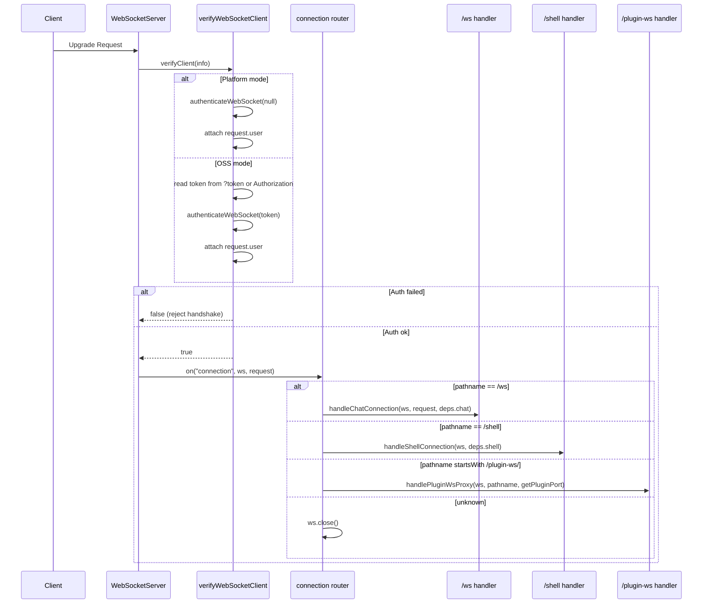
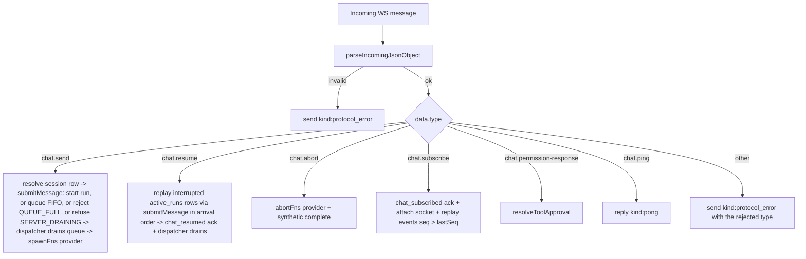
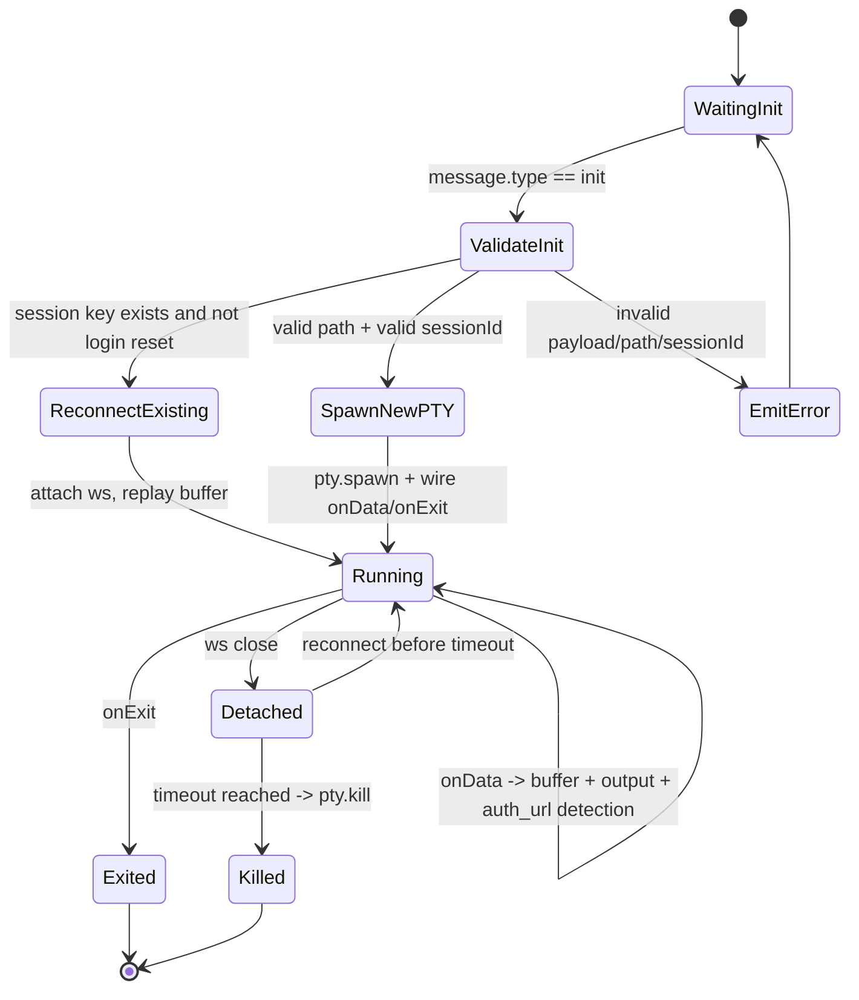
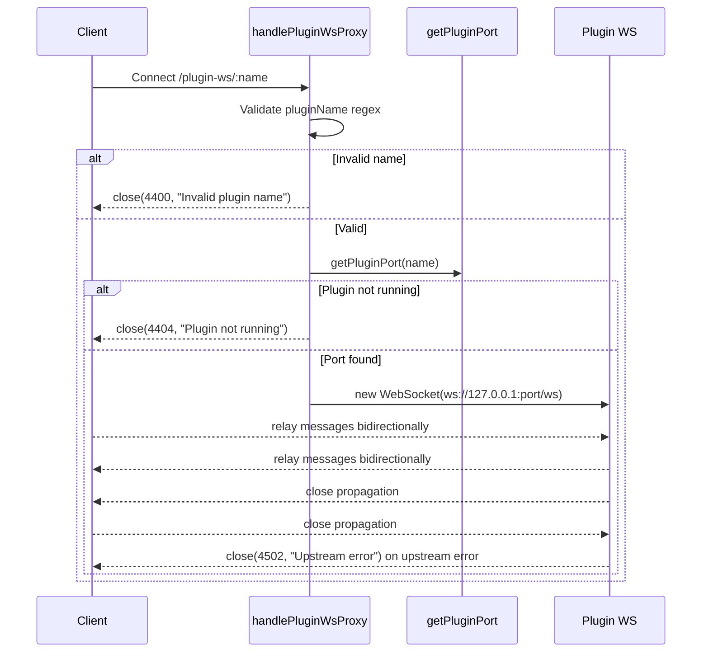

# WebSocket Module

This module owns the server-side WebSocket gateway used by:

1. Chat streaming (`/ws`)
2. Interactive terminal sessions (`/shell`)
3. Plugin WebSocket passthrough (`/plugin-ws/:pluginName`)

It is intentionally structured as **small services** plus a **barrel export** in `index.ts`.

## Public API

`server/modules/websocket/index.ts` exports:

1. `createWebSocketServer(server, dependencies)`  
Creates and wires the shared `ws` server.
2. `connectedClients` and `WS_OPEN_STATE`  
Shared chat client registry and open-state constant used by other modules.

## Why Dependency Injection Is Used

The module receives runtime-specific functions from `server/index.js` instead of importing legacy runtime files directly.

Benefits:

1. Keeps module boundaries clean (`server/modules/*` architecture rule).
2. Makes each service easier to test in isolation.
3. Keeps WebSocket transport concerns separate from provider runtime concerns.

## Service Map

| File | Responsibility |
|---|---|
| `services/websocket-server.service.ts` | Creates `WebSocketServer`, binds `verifyClient`, routes connection by pathname, attaches the ping/pong heartbeat |
| `services/websocket-auth.service.ts` | Authenticates upgrade requests and attaches `request.user` |
| `services/chat-websocket.service.ts` | Handles the `/ws` chat protocol (`chat.send` / `chat.resume` / `chat.abort` / `chat.subscribe` / `chat.permission-response` / `chat.ping`) |
| `services/chat-run-registry.service.ts` | Tracks live provider runs per app session id: seq numbering, event replay buffer, provider-id mapping, completion state, per-session FIFO send queue + single-dispatcher handoff, durable `active_runs` journal + graceful-drain primitives |
| `services/chat-run-reconcile.service.ts` | Startup reconcile: flags `active_runs` rows left by a previous process as `interrupted` so stranded work is surfaced as resumable, never silently lost |
| `services/chat-session-writer.service.ts` | Gateway writer handed to provider runtimes: remaps provider session ids to app ids, swallows `session_created`, assigns `seq` |
| `services/shell-websocket.service.ts` | Handles `/shell` PTY lifecycle, reconnect buffering, auth URL detection |
| `services/plugin-websocket-proxy.service.ts` | Bridges client socket to plugin socket |
| `services/websocket-writer.service.ts` | Adapts raw WebSocket to writer interface (`send`, `setSessionId`, `getSessionId`) for non-chat writer consumers |
| `services/websocket-state.service.ts` | Holds shared chat client set and open-state constant |

## High-Level Architecture

```mermaid
flowchart LR
  A[HTTP Server] --> B[createWebSocketServer]
  B --> C[verifyWebSocketClient]
  B --> D{Pathname}
  D -->|/ws| E[handleChatConnection]
  D -->|/shell| F[handleShellConnection]
  D -->|/plugin-ws/:name| G[handlePluginWsProxy]
  D -->|other| H[close()]

  E --> I[connectedClients Set]
  E --> J[chatRunRegistry + ChatSessionWriter]
  F --> K[ptySessionsMap]
  G --> L[Upstream Plugin ws://127.0.0.1:port/ws]

  I --> M[projects.service loading_progress]
  I --> N[sessions-watcher.service session_upserted]
  I --> O[background-session-sync.service projects_snapshot_stale]
```

## Connection Handshake + Routing



## `/ws` Chat Flow

When a chat socket connects:

1. Add socket to `connectedClients`.
2. Parse each incoming message with `parseIncomingJsonObject`.
3. Dispatch by `data.type` (six message types, none provider-specific).
4. On close, remove socket from `connectedClients` **and** prune it from every
   run's subscriber set via `chatRunRegistry.detachConnectionFromAllRuns(ws)` —
   the runs keep going (buffered events + journal stay intact for the remaining
   and any future subscribers); closing one viewer never cancels a run.

### Session identity model

The frontend only ever knows the **app session id** (allocated by
`POST /api/providers/sessions` or discovered via the session index). The
provider-native id (JSONL file name, CLI resume id) stays inside the backend:

1. `chat.send` resolves the app id to `{ provider, provider_session_id, project_path }` from the sessions DB.
2. The provider runtime receives the provider-native id for resume.
3. The `ChatSessionWriter` remaps every outbound event back to the app id, and turns `session_created` announcements into a DB mapping update instead of forwarding them.

### Chat Message Dispatch



### Chat Notes

1. **Unified envelope**: every server-to-client frame carries a `kind` — either a provider `NormalizedMessage` kind or a gateway kind (`chat_subscribed`, `chat_resumed`, `chat_send_accepted`, `pong`, `session_upserted`, `loading_progress`, `projects_snapshot_stale`, `protocol_error`). Outbound frames never use `type`; the one exception is that a `protocol_error` rejecting an unknown message may echo the offending `type` back (see note 7), which is diagnostic, not a second protocol.
2. **Unified terminal lifecycle**: every provider run ends with exactly one `complete` message built by `createCompleteMessage()` (`server/shared/utils.ts`): `{ kind: "complete", sessionId, actualSessionId, exitCode, success, aborted }`. The chat handler emits a synthetic `complete` for runs that crash or get aborted, and the run registry drops duplicate completes. A **stale-run reaper** in the registry is a last-resort path to that `complete`: if a provider generator wedges without ever emitting one (a never-EOF stream, a stuck tool), a session would otherwise show "running" forever — so a periodic sweep force-completes any running, non-blocked run that has streamed nothing past `CLOUDCLI_RUN_INACTIVITY_TIMEOUT_MS` (default 45 min; `0` disables), best-effort aborting its child first. Runs blocked on a permission/plan prompt are exempt (the stale-*approval* reaper, `CLAUDE_TOOL_APPROVAL_REAP_MS`, owns those).
3. **Per-run event log + multi-subscriber fan-out**: every live event gets a monotonically increasing `seq`. A run holds a **set** of subscriber sockets, not a single one, so `chat.subscribe { sessions: [{ sessionId, lastSeq }] }` **joins** the requesting socket to the live stream (any provider, not just Claude) rather than displacing whoever was already watching — a second device or a reconnecting tab both stream concurrently, and each still gets the terminal `complete` (issue #204). On subscribe, events with `seq > lastSeq` are replayed to the joining socket; if the buffer no longer covers `lastSeq`, the client refreshes over REST. Closed sockets are pruned from the set on the next send and on disconnect. Clients re-subscribe **every** running session (not just the viewed one) on reconnect, so background runs re-attach to the new socket.
4. `chat_subscribed` includes `isProcessing` (replaces `check-session-status`), `pendingPermissions` (replaces `get-pending-permissions`), and `interrupted` (true when a previous process left in-flight/queued work for this session that a `chat.resume` can re-dispatch).
5. **Restart persistence + resume** (`active_runs` table, issue #70): the in-memory run registry is mirrored to a durable SQLite journal — one row per accepted `chat.send` (`running`/`queued`), deleted at the single completion choke point so a clean run leaves no trace. On SIGTERM/SIGINT the server enters a bounded graceful drain (`CHAT_DRAIN_TIMEOUT_MS`, default 10s): new sends are refused with a `SERVER_DRAINING` `protocol_error` while in-flight runs finish. Anything still journaled after a restart is flagged `interrupted` by the startup reconcile and surfaced via `chat_subscribed.interrupted`; `chat.resume { sessionId }` re-dispatches those messages, in arrival order (the head resuming the provider transcript by provider-native id, the rest queueing behind it), and acks with `chat_resumed { sessionId, resumed }`. Net: no in-flight or queued message is silently lost across a restart.
6. **Delivery ack + send idempotency** (issue #389): `chat.send` may carry a client-generated `clientMessageId`. When the server takes ownership of the message — whether it started a run or queued it behind one — it replies `chat_send_accepted { sessionId, clientMessageId, timestamp }`. This exists because the client's only other evidence of delivery is a transcript echo, which a *queued* message does not produce until the run ahead of it finishes; past the client's 30s resend grace that read as "never arrived" and the message was sent twice. The ack is sent **before** the run is awaited, so a long turn cannot delay its own acknowledgement. Because the ack is itself just a frame and can be lost (a half-open socket with a working uplink and a dead downlink), accepted ids are also remembered per session (10 min TTL, 200 ids): a resend of a known id is re-acked and **not** run again. Ids are recorded only after acceptance, so a send rejected for `SERVER_DRAINING` or `QUEUE_FULL` stays retryable. A client that sends no `clientMessageId` gets the old behaviour — the message runs, unacked and undeduped.
7. **Liveness heartbeat** (issue #389): every socket — chat, shell, and plugin-proxy alike — gets a `ws.ping()` every 30s from `attachHeartbeat`, and a socket that fails to answer with a pong before the next beat is `terminate()`d. The ping half keeps reverse proxies from idling the connection out; the pong half is what reaps a peer whose connection has black-holed, which would otherwise sit in `connectedClients` forever still holding the writer for any run fanning out to it. Browsers answer protocol pings automatically, so this direction needs no client cooperation. The reverse direction cannot use protocol pings — browsers never expose them to JavaScript — so clients probe with an application-level `chat.ping`, answered by `pong`. A server too old to know `chat.ping` answers `protocol_error { code: "UNKNOWN_MESSAGE_TYPE", type: "chat.ping" }`; the `type` field exists so a newer client can recognise that rejection as an answer to its own probe and swallow it rather than rendering it into the conversation.

## `/shell` Terminal Flow

The shell handler manages persistent PTY sessions keyed by:

`<projectPath>_<sessionIdOrDefault>[_cmd_<hash>]`

This enables reconnect behavior and isolates command-specific plain-shell sessions.

### Shell Lifecycle



### Shell Behaviors in Detail

1. `init`:
Reads `projectPath`, `sessionId`, `provider`, `hasSession`, `initialCommand`, `isPlainShell`.
2. Login reset:
For login-like commands, existing keyed PTY session is killed and recreated.
3. Validation:
Path must exist and be a directory; `sessionId` must match safe pattern.
4. Command build:
Provider-specific command construction with resume semantics.
5. PTY output buffering:
Stores up to 5000 chunks for replay on reconnect.
6. URL detection:
Strips ANSI, accumulates text buffer, extracts URLs, emits `auth_url` once per normalized URL, supports `autoOpen`.
7. Close behavior:
Socket disconnect does not instantly kill PTY; session is kept alive and terminated on timeout.

## `/plugin-ws/:pluginName` Proxy Flow



## Shared Client Registry and Broadcasts

Only chat sockets (`/ws`) are tracked in `connectedClients`.

That shared set is consumed by:

1. `modules/projects/services/projects-with-sessions-fetch.service.ts`
Broadcasts `kind: loading_progress` while project snapshots are being built.
2. `modules/providers/services/sessions-watcher.service.ts`
Broadcasts per-session `kind: session_upserted` deltas when provider session artifacts change (no full project snapshots).
3. `modules/providers/services/background-session-sync.service.ts`
Broadcasts `kind: projects_snapshot_stale` when a background provider scan indexed new or changed sessions (#302). `GET /api/projects` answers from the persisted SQLite index without awaiting a rescan, so this is how a client learns its snapshot has been superseded. It is a bare signal, not a delta — the scan reports per-provider counts, not the session ids it touched — and the client answers with one silent refetch.

This design centralizes cross-module realtime fanout without requiring route-local references to WebSocket internals.

## Writer Adapter (`WebSocketWriter`)

`WebSocketWriter` normalizes chat transport behavior to match existing writer-style interfaces used elsewhere.

Methods:

1. `send(data)`  
JSON-serializes and sends only if socket is open.
2. `setSessionId(sessionId)` / `getSessionId()`  
Supports provider session bookkeeping and resume flows.
3. `updateWebSocket(newRawWs)`  
Allows active session stream redirection on reconnect.

## Error Handling and Close Codes

Current explicit close codes in this module:

1. `4400`: Invalid plugin name
2. `4404`: Plugin not running
3. `4502`: Upstream plugin WebSocket error

Other errors:

1. Chat handler catches and emits `{ kind: "protocol_error", code, error, sessionId }`. An `UNKNOWN_MESSAGE_TYPE` rejection also carries `type`, the client message type that was rejected.
2. Shell handler catches and writes terminal-visible error output.
3. Unknown websocket paths are closed immediately.
4. A socket that misses a heartbeat pong is terminated (see Chat Notes 7); the kill is logged as `[Heartbeat] Terminating unresponsive <path>`.

## Extending This Module

To add a new websocket route:

1. Add a new handler service under `services/`.
2. Extend `WebSocketServerDependencies` in `websocket-server.service.ts` if needed.
3. Add a new pathname branch in the router.
4. Wire dependency injection from `server/index.js`.
5. Keep `index.ts` as barrel-only export surface.
